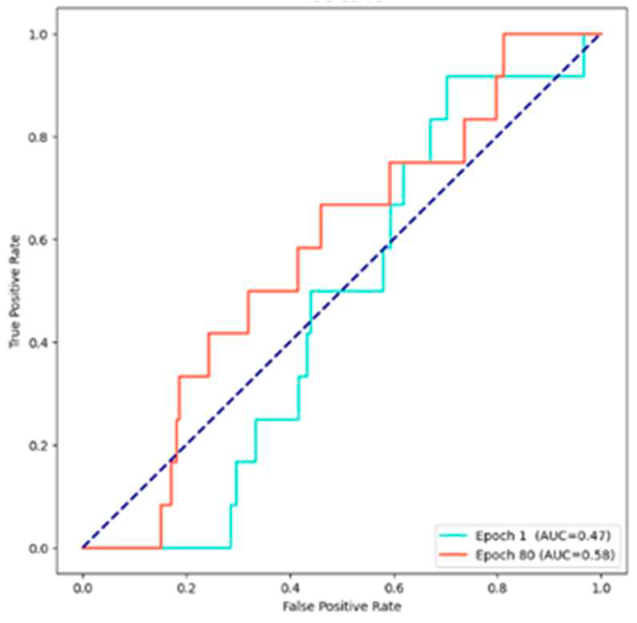

# GNN_Traffic_Classification_Project

<!-- TOC -->
* [概要](#概要)
* [ディレクトリ構成](#ディレクトリ構成)
* [ディレクトリとファイルの説明](#ディレクトリとファイルの説明)
* [データフォルダについて](#データフォルダについて)
* [実験概要](#実験概要)
    * [目的](#目的)
    * [データセット](#データセット)
    * [使用技術](#使用技術)
    * [モデル](#モデル)
    * [結果](#結果)
        * [宮崎市データセット結果](#宮崎市データセット結果)
* [実行方法](#実行方法)
* [結論](#結論)
* [参考](#参考)
<!-- TOC -->

## 概要
このプロジェクトでは、グラフニューラルネットワーク（GNN）を使用して、交通事故リスクを分類するテスト実験を行いました。

以下はその概要です。


## ディレクトリ構成
```
.
├── README.md
├── requirements.txt
├── Dockerfile
├── docker-compose.yml
├── src
│   ├── create_dataset.py
│   ├── data_loading.py
│   ├── data_preprocessing.py
│   ├── main.py
│   ├── models.py
│   └── visualization.py
└── data
    ├── 2019_miyazaki_latlot.csv
    ├── 2020_miyazaki_latlot.csv
    └── 2021_miyazaki_latlot.csv
```

## ディレクトリとファイルの説明
- `README.md`: プロジェクトの説明や使い方を記載したファイル。
- `requirements.txt`: プロジェクトで必要なPythonパッケージのリスト。
- `Dockerfile`: Dockerコンテナを構築するための設定ファイル。
- `docker-compose.yml`: Docker Composeを使用してマルチコンテナDockerアプリケーションを定義するための設定ファイル。
- `src`: ソースコードディレクトリ。
  - `create_dataset.py`: データセットを作成するためのスクリプト。
  - `data_loading.py`: データを読み込むためのスクリプト。
  - `data_preprocessing.py`: データの前処理を行うためのスクリプト。
  - `main.py`: メインの実行スクリプト。
  - `models.py`: モデルの定義を行うスクリプト。
  - `visualization.py`: 可視化を行うためのスクリプト。

## データフォルダについて

`data`フォルダには、以下のCSVファイルを配置してください：

- `2019_miyazaki_latlot.csv`
- `2020_miyazaki_latlot.csv`
- `2021_miyazaki_latlot.csv`

交通事故オープンデータ元：https://www.npa.go.jp/publications/statistics/koutsuu/opendata/index_opendata.html

**注意**: 
これらのデータはそのままではOSMnxに利用できません。 データを加工し、**世界測地系**に変換する必要があります。
このため、データを直接アップロードしていません。データを準備する際には、必ず世界測地系に変換する処理を行ってください。


## 実験概要

### 目的

交通事故の発生確率に基づいて交通事故を分類するために、GNNを用いて交通ネットワークを分析することを目指します。

### データセット

- 宮崎市の交通事故データ（2019年～2021年）を使用。
- OpenStreetMap（OSM）から取得した道路ネットワークデータを使用。

### 使用技術

- **プログラミング言語**: Python
- **機械学習ライブラリ**: PyTorch, PyTorch Geometric
- **地理情報システム**: Networkx, OSMnx, GeoPandas
- **データ処理**: Pandas, NumPy
- **可視化**: Matplotlib, Seaborn
- **その他ライブラリ**: Scikit-learn, tqdm
- **コンテナ化**: Docker, Docker Compose

### モデル

- Graph Convolutional Network (GCN) を使用。

### 結果

- 擬似データセットを使用した場合、AUCは0.90を達成。
- 宮崎市の実データセットを使用した場合、AUC(Area Under ROC-curve)は0.58を達成。
#### 宮崎市データセット結果




## 実行方法

1. 必要なデータを`data`フォルダに配置します。
2. Dockerコンテナをビルドし、起動します。
```shell
docker-compose up --build
docker-compose exec app python src/main.py
```

# 結論

GNNを用いて交通事故リスクを分類する手法の有効性を確認するためのテスト実験を行いました。

擬似データセットでは良好な結果が得られましたが、実データセットでの結果はまだ改善の余地があります。

今後の方針としては、データの不均衡や属性情報の追加など考えられる。

# 参考

* [Pytorch geometricで理解するGCNs(公式ドキュメント和訳）](https://github.com/omiita/PyTorchGeometric-Tutorial/blob/master/PyTorch_Geometric_Tutorial.ipynb)
* [「GNN-Pytorchによる実装（著者：村田剛志 氏）」のサポートページ](https://github.com/atarum/GraphNeuralNetworks/tree/main) 
* [オリジナルのグラフデータセット作成（公式）](https://pytorch-geometric.readthedocs.io/en/latest/tutorial/create_dataset.html)
* [tomiharu0317 氏の立川市のネットワーク分析](https://github.com/tomiharu0317/congestion-analysis)


